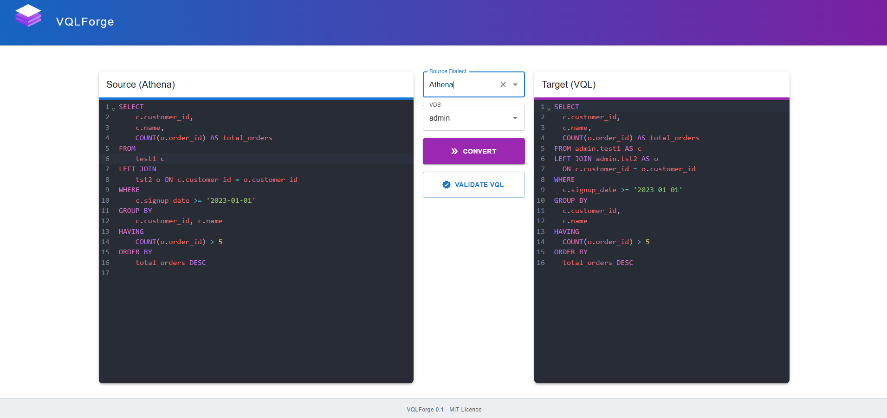

# VQLForge

VQLForge translates various SQL dialects into Denodo VQL using a React frontend and a Python/FastAPI backend powered by the `sqlglot` library.

It helps accelerate migrations to Denodo by automating SQL-to-VQL conversion.


## Features

*   Converts 24 SQL dialects (e.g., DuckDB, Trino, Spark, Snowflake, BigQuery) to Denodo VQL via `sqlglot`.
    *   *Note:* Conversion capabilities depend on `sqlglot`'s support for specific SQL features per dialect. See [sqlglot documentation](https://github.com/tobymao/sqlglot).
*   AI Assistant (PydanticAI + Google Gemini) that:
    *   Analyzes `sqlglot` conversion errors.
    *   Validates generated VQL against a connected Denodo VDP instance.
    *   Requires a Gemini API key and a connection to Denodo VDP for validation.
*   Web UI for SQL input, dialect selection, VQL output, and AI analysis/validation results.
*   Handles common syntax conversions supported by `sqlglot`.

## Technologies Used

*   **Frontend:** React
*   **Backend:** Python, FastAPI
*   **Conversion:** `sqlglot`
*   **AI Assistant:** PydanticAI, Google Gemini API
*   **Deployment:** Docker, Docker Compose

## Installation and Setup

1.  **Prerequisites:** Docker, Docker Compose. [Get Docker](https://docs.docker.com/get-docker/)
2.  **Clone:**
    ```bash
    git clone https://github.com/banickn/VQLForge.git
    cd VQLForge
    ```
3.  **Configure Environment:** Create a `.env` file in the project root based on the `template.env` and add your Gemini API key and Denodo properties:
    This is required for all AI Assistant features.
4.  **Docker Network (Required for VDP Validation):** For the AI VQL validation feature, ensure a `denodo-docker-network` exists (`docker network create denodo-docker-network`) and your Denodo VDP container is connected to it.
5.  **Run:**
    If you want to build the images yourself for local development use:
    ```bash
     docker-compose -f docker-compose.yml -f docker-compose.dev.yml up --build -d
    ```

    For a prod setup with prebuilt images use:
    ```bash
    docker-compose -f docker-compose.yml -f docker-compose.prod.yml up -d
    ```
    Images (`ghcr.io/banickn/vqlforge-backend:main`, `ghcr.io/banickn/vqlforge-frontend:main`) will be pulled from GHCR.
6.  **Access:**
    *   **UI:** `http://localhost:4999`
    *   **API:** `http://localhost:5000` (Docs: `http://localhost:5000/docs`)

## How to Use

1.  Open the UI (`http://localhost:4999`).
2.  Select the source SQL dialect.
3.  Paste your SQL query.
4.  Click "Convert".
5.  View the resulting Denodo VQL.
6.  If the AI assistant is configured (API key) and VDP connection is available (for validation), view the AI's analysis of conversion errors or VQL validation results.

## AI Assistant

*   Uses Google Gemini via PydanticAI to:
    *   Explain `sqlglot` conversion errors.
    *   Connect to a Denodo VDP instance to validate the generated VQL query and report success or Denodo errors.
*   Requires `AI_API_KEY` in `.env` for all functions.
*   Requires Denodo VDP connection details (see below) for the validation function.
*   Future work involves deeper integration using a more agentic AI approach for complex error handling and suggestions.

## Denodo VDP Connection

*   The backend connects to Denodo VDP for the AI VQL validation feature.
*   **Network:** Expects the Denodo VDP container to run on the `denodo-docker-network`.
*   **Credentials:** Uses default Denodo credentials (`admin`/`admin`) for connection. This is **not suitable for production** and should be configured securely if deployed outside local development.
*   Basic `sqlglot` conversion (without AI validation) does **not** require a Denodo connection.

## Contributing

Contributions are welcome. Please open an issue or submit a pull request.

## License
[MIT](https://choosealicense.com/licenses/mit/)