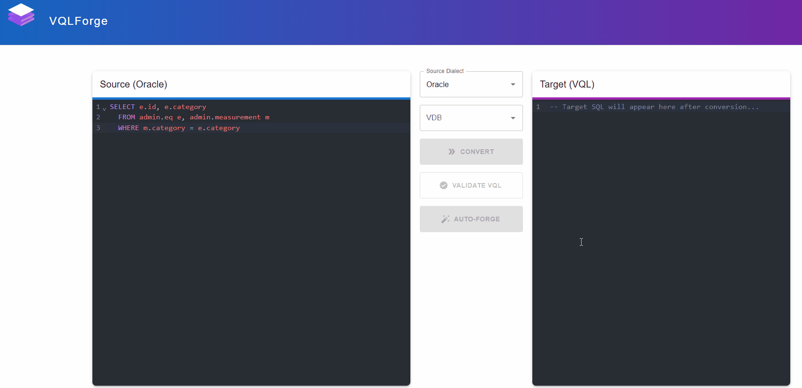

# VQLForge
**Translate SQL to Denodo VQL with ease, powered by AI insights.**

VQLForge translates various SQL dialects into Denodo VQL using a React frontend and a Python/FastAPI backend powered by the `sqlglot` library.

It helps accelerate migrations to Denodo by automating SQL-to-VQL conversion.

[](https://opensource.org/licenses/MIT)
[](https://www.python.org/downloads/)



## Why VQLForge?

Migrating SQL to Denodo's VQL can be a time-consuming and error-prone process. VQLForge aims to:

*   **Accelerate Migrations:** Automate the bulk of SQL-to-VQL translation by using the UI or the REST API.
*   **Reduce Errors:** Leverage `sqlglot` for robust parsing and AI for error analysis and VQL validation.
*   **Improve Developer Productivity:** Provide a user-friendly interface for quick conversions.


## Features

*   **Converts 24 SQL dialects** (e.g., DuckDB, Trino, Spark, Snowflake, BigQuery) to Denodo VQL via `sqlglot`.
    *   *Note:* Conversion capabilities depend on `sqlglot`'s support for specific SQL features per dialect. See [sqlglot documentation](https://github.com/tobymao/sqlglot).
*   Web UI for SQL input, dialect selection, VQL output, and AI analysis/validation results.
*   Handles common syntax conversions supported by `sqlglot`.
*   **AI Assistant** that:
    *   Analyzes `sqlglot` conversion errors.
    *   Validates generated VQL against a connected Denodo VDP instance.
    *   Requires a Gemini API key and a connection to Denodo VDP for validation.
*   **Agentic Auto-Forge Mode**: A powerful one-click workflow that automates the entire process:
    *  **Translate**: Converts the source SQL to VQL.
    *  **Validate**: Checks the VQL against Denodo.
    *  **Analyze**: If validation fails, the AI agent diagnoses the error, identifying issues like missing views, incorrect functions, or syntax problems.
    *  **Correct**: The agent generates a corrected VQL query based on its analysis.
    *  **Re-Validate**: The agent automatically re-runs validation on the corrected query.

## Technologies Used

*   **Frontend:** React
*   **Backend:** Python, FastAPI
*   **Conversion:** `sqlglot`
*   **AI Assistant:** PydanticAI, Google Gemini API
*   **Deployment:** Docker, Docker Compose

### Prerequisites

-   Docker and Docker Compose
-   Access to a Denodo instance
-   An API key for an LLM provider (**Google Gemini** or **Azure OpenAI**)

## Installation and Setup

2.  **Clone:**
    ```bash
    git clone https://github.com/banickn/VQLForge.git
    cd VQLForge
    ```
3.  **Configure Environment:** Create a `.env` file in the project root by copying `template.env` (`cp template.env .env`). Then, modify the following properties:

    | Variable            | Description                                                                 | Required for           | Example                     |
    |---------------------|-----------------------------------------------------------------------------|------------------------|-----------------------------|
    | `DENODO_HOST`       | Denodo VDP server URL                                                       | AI Validation          | `denodo-server.example.com` |
    | `DENODO_DB`         | Default Denodo Virtual DataBase (VDB)                                       | AI Validation          | `my_vdb`                    |
    | `DENODO_USER`       | Denodo user with read/execute access to VDBs                                | AI Validation          | `denodo_user`               |
    | `DENODO_PW`         | Password for the Denodo user                                                | AI Validation          | `password`                  |
    | `GEMINI_API_KEY`    | GEMINI API Key                                                              | AI Assistant           | `YOUR_AI_API_KEY`           |
    | `OPENAI_API_KEY`    | openAI API Key                                                              | AI Assistant           | `YOUR_AI_API_KEY`           |
    | `AZURE_OPENAI_ENDPOINT` | URL to your openAI endpoint deployed in Azure                           | AI Assistant           | `https://endpoint`          |
    | `AI_MODEL_NAME`     | Model name (e.g., gemini-2.5-flash or gpt-5-nano)                           | AI Assistant           | `gemini-2.5-flash`          |
    | `APP_NETWORK_NAME`  | Docker network name for connecting to Denodo (if Denodo is also in Docker)  | AI Validation          | `denodo-lab-net`            |
    | `HOST_PROJECT_PATH` | Absolute path to your local VQLForge repository directory.                  | Translation (VDBs)     | `/path/to/your/VQLForge`    |

    These configurations are required to run the advanced query analysis features.

4.  **Configure Denodo VDBs:**
    Edit `./backend/vdb_conf.yaml` to list your available Denodo VDB names. This allows them to be selectable in VQLForge when using AI validation features.
    ```yaml
    # ./backend/vdb_conf.yaml
    vdbs:
    - admin
    - test
    - placeholder1

    ```

5.  **Docker Network (Required for VDP Validation):** For the AI VQL validation feature, ensure a `denodo-docker-network` exists (`docker network create denodo-docker-network`) and your Denodo VDP container is connected to it.

6.  **Run:**
    If you want to build the images yourself for local development use:
    ```bash
     docker-compose -f docker-compose.yml -f docker-compose.dev.yml up --build -d
    ```

    For a prod setup with prebuilt images use:
    ```bash
    docker-compose -f docker-compose.yml -f docker-compose.prod.yml up -d
    ```
    Images (`ghcr.io/banickn/vqlforge-backend:main`, `ghcr.io/banickn/vqlforge-frontend:main`) will be pulled from GHCR.
6.  **Access:**
    *   **UI:** `http://localhost:4999`
    *   **API:** `http://localhost:5000` (Docs: `http://localhost:5000/docs`)

## How to Use

1.  Open the UI (`http://localhost:4999`).
2.  Select the source SQL dialect.
3.  Paste your SQL query.
4.  Click "Convert".
5.  View the resulting Denodo VQL.
6.  If the AI assistant is configured (API key) and VDP connection is available (for validation), view the AI's analysis of conversion errors or VQL validation results.


## Denodo VDP Connection

*   The backend connects to Denodo VDP for the AI VQL validation feature.
*   **Network:** Expects the Denodo VDP container to run on the `denodo-docker-network`.
*   **Credentials:** Uses default Denodo credentials (`admin`/`admin`) for connection. This is **not suitable for production** and should be configured securely if deployed outside local development.
*   Basic `sqlglot` conversion (without AI validation) does **not** require a Denodo connection.

## Roadmap

* Improved sqlglot denodo dialect for better translations.
* Advanced mode for SQL performance improvements
* SQL inline comment generation from metadata
* Support for various AI APIs and models

## Contributing

Please open an issue to discuss potential changes or submit a pull request with your improvements. We appreciate contributions for bug fixes, new features, or documentation enhancements.

## License
[MIT](https://choosealicense.com/licenses/mit/)